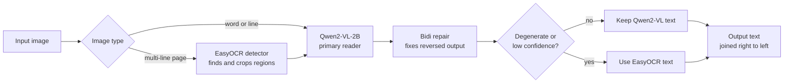
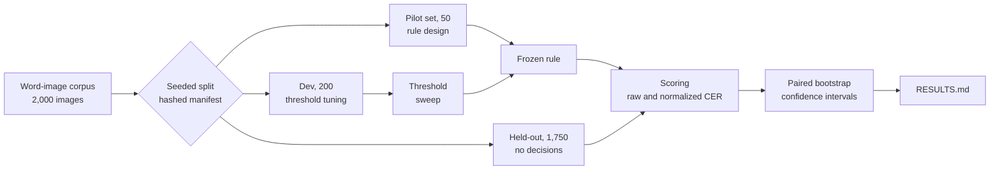

# MO-OCR v3

[](https://doi.org/10.5281/zenodo.23080386)
[](./LICENSE)
[](./pyproject.toml)
[](./pyproject.toml)

**Arabic OCR that fuses a vision-language model with a dedicated OCR engine,
measured by an evaluation harness strict enough to publish from.**

MO-OCR v3 reads Arabic text with Qwen2-VL-2B and falls back to EasyOCR
whenever the language model's output looks unreliable. On 1,750 held-out
word images it cuts the character error rate by 25% relative to the EasyOCR
baseline. Every number in this repository is reproducible from a script,
and results that did not work are reported alongside those that did.

## Results

Held-out split, 1,750 images. No decision used this split.

| System | CER (normalized) | Exact match |
|---|---|---|
| EasyOCR baseline | 0.2294 | 14.1% |
| Qwen2-VL-2B alone | 2.3470 | 29.4% |
| **MO-OCR arbitration** | **0.1710** | **32.7%** |

The improvement over the baseline is −0.0584 corpus CER, with a 95% paired
bootstrap confidence interval of −0.0664 to −0.0505.

This result is sensitive to one hand-set limit. The length limit in the
degeneration flag was lowered from 40 to 30 characters after two refusals
slipped through on the 50-image pilot set. With the original limit the
held-out error rate is 0.2057 instead of 0.1710. The two versions differ on
15 of the 1,750 outputs. Exact match is 32.6% and 32.7% respectively.

Qwen2-VL alone has the best exact-match rate and the worst error rate. It
either reads a word perfectly or produces long off-topic text. Arbitration
keeps the first behaviour and removes the second. Full tables, per-slice
breakdowns and the error budget are in [RESULTS.md](./RESULTS.md).

## How it works

### Recognition pipeline



The gate uses two signals, and neither needs ground truth:

- **Degeneration flag.** Output longer than a crop could plausibly contain,
  or containing non-Arabic letters, is treated as a failed read. On the
  held-out split this caught 369 of 385 catastrophic outputs with zero false
  alarms on correct ones.
- **Confidence threshold.** The geometric mean of Qwen2-VL's token
  probabilities must reach 0.40 for word crops. This value was chosen on the
  dev split.

Neither test is enough alone. On the held-out split the flag alone scores
0.2235 and the threshold alone 0.8415.

EasyOCR's own confidence score is never used for routing. Its correlation
with correctness ranged from 0.09 to 0.28 across the three splits.

### Evaluation protocol



The harness is model-agnostic. It imports no model code, so any engine that
implements one `recognize(image)` method can be scored. It reports:

- **CER twice**, on raw Unicode and on normalized text. The gap between the
  two separates orthographic differences from real recognition errors.
- **Paired bootstrap confidence intervals** on every comparison, using
  10,000 resamples.
- **A bidi check** that detects text stored in visual order before it is
  mistaken for a recognition failure.
- **Fix and break counts** for any correction stage, reported in both
  directions.
- **Failure accounting.** A failed sample is scored as a total miss and
  also counted separately. Nothing is dropped from a denominator.

Character error rate and exact match are the principal metrics, a reporting
choice suited to single-word data. Word error rate is still defined: it is
the total of word substitutions, deletions and insertions divided by the
number of reference words. Each reference has one word but hypotheses may
have several, so insertions can push it above 1, and it is not in general the
same as the exact-mismatch rate.
On the held-out split, after normalization, it is 1.01 for EasyOCR, 3.80 for
Qwen2-VL and 0.77 for arbitration (`results/paper_stats.json`).

## What did not work

These are measured outcomes, kept in the record on purpose.

| Attempt | Outcome | Decision |
|---|---|---|
| Community Arabic TrOCR checkpoints, four tried on ten images | None read a word correctly as downloaded; one failed to run. A compatibility screen, not a ranking | Not used |
| CamelBERT post-correction | Never fixed more words than it broke. Harmful at small margins, no measurable effect at the strictest (19 fixed, 19 broken) | Shipped disabled |
| LayoutLMv3 structuring | Integrated and smoke-tested, but no labelled data exists to score it | No claim made |

## Installation

Requires Python 3.11 or newer and [uv](https://docs.astral.sh/uv/).

```bash
git clone https://github.com/moelhaj996/mo-ocr-v3.git
cd mo-ocr-v3
uv sync --extra models
```

The `models` extra installs PyTorch, Transformers and EasyOCR. Model weights
download on first use. The unit tests need no model weights:

```bash
uv run pytest -q
```

## Usage

Read a single word or line:

```python
from PIL import Image
from moocr.config import Config
from moocr.models.base import get_engine

engine = get_engine("arbitration", Config())
result = engine.recognize(Image.open("word.png").convert("RGB"))

print(result.text)
print(result.confidence, result.extra["routed"])
```

Read a multi-line page:

```python
engine = get_engine("page", Config())
print(engine.recognize(Image.open("page.png").convert("RGB")).text)
```

Score an engine on a split:

```bash
uv run python -m moocr.harness.evaluate \
  --engine easyocr \
  --manifest manifests/manifest_apti.json \
  --split golden \
  --out results/easyocr_golden.json
```

Compare two runs with a paired bootstrap:

```bash
uv run python -m moocr.harness.compare results/run_a.json results/run_b.json
```

Regenerate every reported number:

```bash
./scripts/reproduce.sh
```

The images are not distributed with this repository. They are the first
2,000 rows of the Hugging Face dataset `mssqpi/Arabic-OCR-Dataset`, which was
no longer publicly accessible in September 2026, so its license could not be
confirmed. The folder and manifest are named `apti` for historical reasons
only, and there is no evidence the images come from the APTI database. The
committed manifest records a SHA-256 hash for every file. Without the images,
reproduction means rescoring the published run files. The committed run files
predate the current wording of the harness's note on WER, so the `scores.wer`
text inside them is superseded by `results/paper_stats.json`.

## Repository layout

| Path | Contents |
|---|---|
| `src/moocr/models/` | Recognition engines and the page engine |
| `src/moocr/fusion.py` | Arbitration between engines |
| `src/moocr/bidi.py` | Repair of visual-order Arabic output |
| `src/moocr/normalization.py` | Versioned Arabic normalization, scoring and output profiles |
| `src/moocr/metrics.py` | CER, paired bootstrap, confusion report |
| `src/moocr/harness/` | Evaluation, comparison, error budget, fusion simulation |
| `manifests/` | Split assignment with per-file hashes |
| `results/` | Every run file behind the reported numbers |
| `scripts/` | Reproduction, policy sweep and calibration scripts |
| `tests/` | Unit tests for every component |

## Documentation

- [paper/paper.pdf](./paper/paper.pdf) is the technical report.
- [RESULTS.md](./RESULTS.md) has every measured number, including rejected changes.
- [METHOD.md](./METHOD.md) describes the pipeline precisely enough to reimplement.
- [LIMITATIONS.md](./LIMITATIONS.md) states what the system and its evaluation do not cover.
- [PLAN.md](./PLAN.md) records the architecture and milestones.

## Limitations

The quantitative evaluation covers 2,000 small synthetic printed word
images from one source whose provenance is not fully established. The
7.8x cost figure for arbitration is reconstructed from per-engine timings,
not a live measurement of the combined engine. Handwriting, dialectal text and full-page layouts are
not measured. The page engine works, but its thresholds were set by
inspection and carry no accuracy claim. See
[LIMITATIONS.md](./LIMITATIONS.md) for the complete statement.

## How to cite

The technical report is published on Zenodo: https://doi.org/10.5281/zenodo.23080386

```bibtex
@techreport{elhajsuliman2026moocr,
  author    = {ElhajSuliman Elnaim Suliman, Mohamed},
  title     = {Confidence-routed arbitration between a vision-language model
               and a dedicated {OCR} engine for {Arabic} word recognition},
  year      = {2026},
  month     = oct,
  institution = {Zenodo},
  doi       = {10.5281/zenodo.23080386},
  url       = {https://doi.org/10.5281/zenodo.23080386}
}
```

A `CITATION.cff` file is included, so GitHub's "Cite this repository" button gives the same reference.

## License

Licensed under the [Apache License 2.0](./LICENSE).

This license covers the code in this repository. Third-party model weights
are downloaded at run time and keep their own licenses:

| Component | License |
|---|---|
| Qwen2-VL-2B-Instruct | Apache-2.0 |
| EasyOCR | Apache-2.0 |
| CamelBERT | Apache-2.0 |
| LayoutLMv3 base weights | CC BY-NC-SA 4.0, non-commercial use only |

The evaluated configuration uses only Qwen2-VL and EasyOCR.
